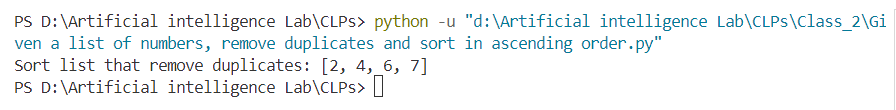
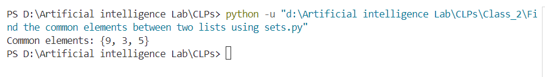
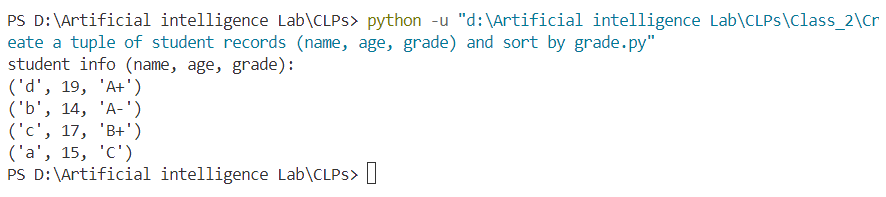
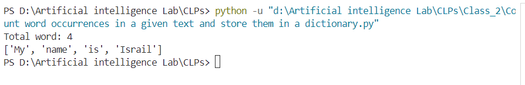
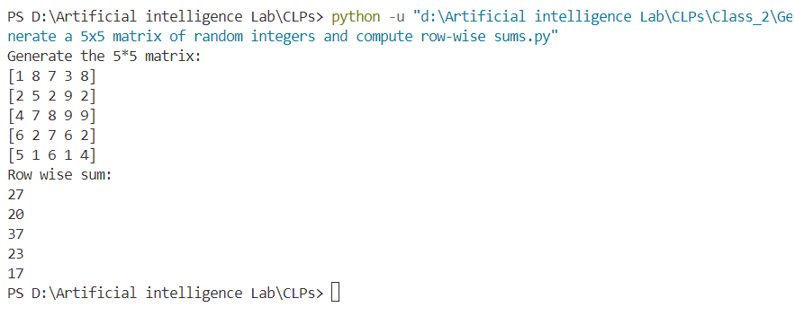
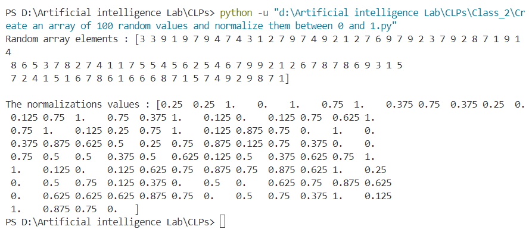
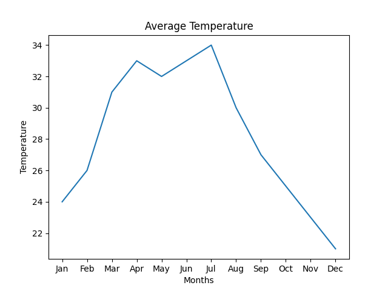
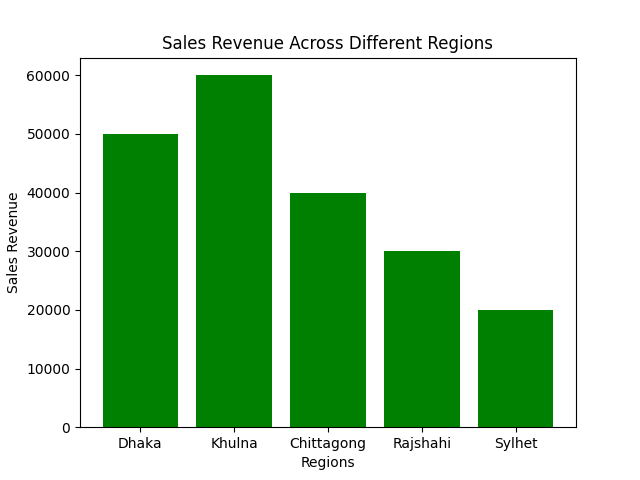

<ul>
<li>Given a list of numbers, remove duplicates and sort in ascending order</li>
<b>Output: </b> 

<li>Find the common elements between two lists using sets.</li>
<b>Output: </b> 

<li> Create a tuple of student records (name, age, grade) and sort by grade.</li>
<b>Output: </b> 

<li>Count word occurrences in a given text and store them in a dictionary.</li>
<b>Output: </b> 

<li>Generate a 5x5 matrix of random integers and compute row-wise sums.</li>
<b>Output: </b> 

<li>Create an array of 100 random values and normalize them between 0 and 1.</li>
<b>Output: </b> 

<li>Load a CSV file of sales data and compute total revenue per product.</li>
<b>Output: </b> 

<li>Fill missing values in a dataset with column-wise means.</li>
<b>Output: </b> 

<li>Plot a line graph showing temperature variations over a week.</li>
<b>Output: </b> 

<li>Create a bar chart comparing sales revenue across different regions.</li>
<b>Output: </b> 

 
</ul>
